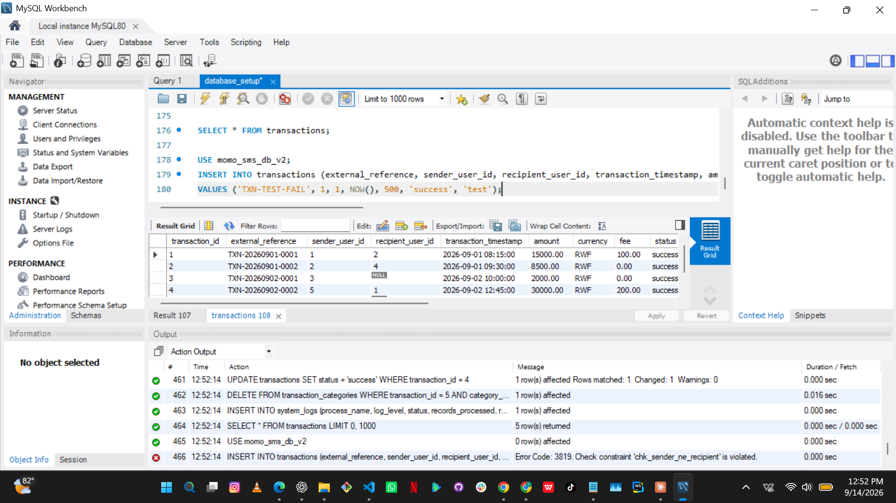

# Database CRUD Testing Evidence

This document records the testing performed against the schema defined in
[`database_setup.sql`](database_setup.sql), run on a live MySQL 8.0
instance via MySQL Workbench. It covers all four CRUD operations and
verifies that the schema's data-integrity constraints are actually
enforced by the database.

---

## 1. CRUD Operations

All four operations were executed in a single session against the
`momo_sms_db_v2` database. The Workbench Output panel below shows each
statement and its result.


### CREATE

```sql
INSERT INTO system_logs (process_name, log_level, status, records_processed, records_successful, records_failed, source_file)
VALUES ('validation', 'INFO', 'success', 5, 5, 0, 'momo_week2.xml');
```

**Result:** 1 row affected — new pipeline log entry created.

### READ (joined query)

```sql
SELECT t.external_reference, s.full_name AS sender, r.full_name AS recipient,
       t.amount, GROUP_CONCAT(c.category_name SEPARATOR ', ') AS categories
FROM transactions t
LEFT JOIN users s ON s.user_id = t.sender_user_id
LEFT JOIN users r ON r.user_id = t.recipient_user_id
JOIN transaction_categories tc ON tc.transaction_id = t.transaction_id
JOIN transaction_categories_lookup c ON c.category_id = tc.category_id
GROUP BY t.transaction_id
ORDER BY t.transaction_timestamp;
```

**Result:** 5 rows returned. This query exercises every relationship in the
schema at once — both foreign keys to `users`, and the many-to-many
junction through `transaction_categories` to
`transaction_categories_lookup`. It returns readable names and category
labels rather than raw ID numbers, confirming the relationships resolve
correctly.

### READ (raw table)

```sql
SELECT * FROM transactions;
```

**Result:** 5 rows returned — the normalized table as stored, showing
foreign key columns in their raw form for comparison against the joined
view above.

### UPDATE

```sql
UPDATE transactions SET status = 'success' WHERE transaction_id = 4;
```

**Result:** 1 row affected, 1 row changed — transaction moved from
`pending` to `success`.

### DELETE

```sql
DELETE FROM transaction_categories WHERE transaction_id = 5 AND category_id = 1;
```

**Result:** 1 row affected — one category assignment removed from a
transaction that had two, leaving the transaction itself and the category
record intact. This demonstrates that the junction table can be modified
independently of the entities it links.

---

## 2. Constraint Enforcement

Beyond confirming that valid operations succeed, the following tests
confirm that *invalid* operations are rejected by the database itself —
not merely by application logic.

### CHECK constraint: sender cannot equal recipient



```sql
INSERT INTO transactions (external_reference, sender_user_id, recipient_user_id, transaction_timestamp, amount, status, original_sms)
VALUES ('TXN-TEST-FAIL', 1, 1, NOW(), 500, 'success', 'test');
```

**Result:** `Error Code: 3819. Check constraint 'chk_sender_ne_recipient' is violated.`

The insert was correctly rejected. A transaction where the same user is
both sender and recipient is logically invalid, and the schema prevents it
from ever being stored.

---
