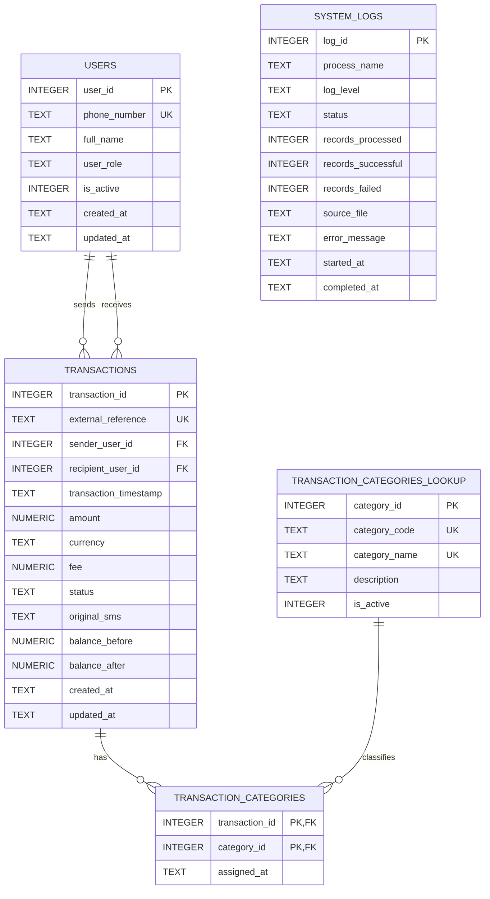

# MoMo SMS Database ERD

This diagram is rendered by GitHub from Mermaid syntax. It is maintained beside the
SQL implementation so the visual design and the database structure stay consistent.

## Relationship Notes

- One user can send many transactions.
- One user can receive many transactions.
- One transaction can have many category assignments.
- One category can classify many transactions.
- `transaction_categories` resolves the many-to-many relationship between transactions
  and categories.
- `system_logs` records ETL activity independently of transaction records.

## Source

The authoritative implementation is [database/database_setup.sql](../database/database_setup.sql).